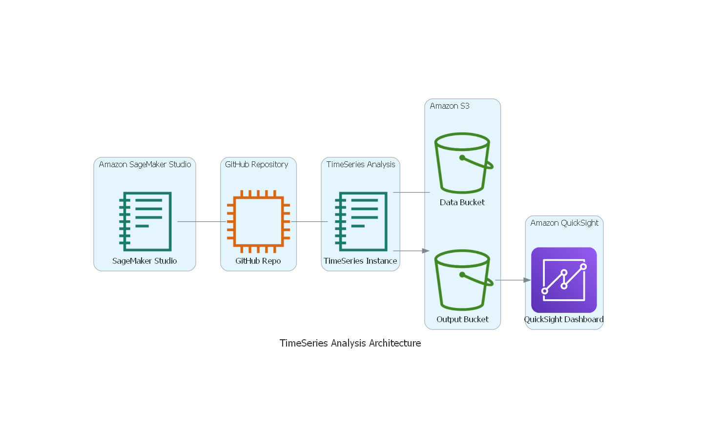

# The Architecture Diagram


# BasicTimeSeries Automation
This part has three classes: TimeSeries, ARIMA and SARIMA classes.
TimeSeries is the parent class that takes care of common time series tasks such as:
1) Time Series Plots
2) Decomposition plots
3) Stationarity Checks
4) acf and pacf
- For best results, rigorously clean your data and make sure there are no missing dates
- Note: The data should already have its index set to the time it represents, e.g using 
```bash
pd.set_index('date_time_column', inplace = True)
```
And also make sure that the data's datetime variable is in datetime format e.g by doing this:
```bash
data["date_column"] = pd.to_datetime(data["date"])
# Or if its yearly data
data["year"] = pd.to_datetime(data["year"], format="%Y")
```
## ARIMA models
ARIMAModels is a class that inherits from the TimeSeries class, with some specific functionalities that include fitting an ARIMA model, checking the performance of the ARIMA model and forecasting using the ARIMA model thats fitted.
Below is a limited sample of how to use the ARIMAModels class:
```bash
arima_model = ARIMAModels()
```
Visualizing the trend ,decomposition via decomposition plots and correlation function using acf and pacf
```bash
arima_model.trend_visualizations(data)
arima_model.decomposition_plot(data, model='additive', period='None') # The period is None and the model is additive by default. The period should be adjusted according to data. The data can be a pandas DataFrame or a pandas Series.
arima_model.correlation_function(data, lags=10) # lags=10 is the default, and can be changed if need be.
```
Checking for stationarity
```bash
arima_model.stationarity_check(data, signif=0.05) # signif=0.05 is the alpha value, 
# can be changed if need be. In this  case stationarity is being checked at 95% confidence level.
```
Evaluating the best fitting model
```bash
arima_model.model_evaluation(train, test, p_values, d_values, q_values) 
# train parameter should be a Pandas Series, which is the training dataset; 
# test parameter should be a Pandas Series, which is the test dataset; 
# p_values is a list of the range of values that you wish to check for the AR part of ARIMA model
# d_values is a list of the range of values that you wish to check for the difference part
# q_values is a list of the range of values that you wish to check for the MA part of ARIMA model
```
best_model method fits the best model obtained from the function above and checks timeseries assumptions
by comparing the model's prediction and actual test dataset using a line chart. It also checks for serial
correlation using Ljung-Box test.
```bash
arima_model.best_model(train_data,test_data,order=(2,1,1),lags=10) 
# train_data represents the data to be modelled and should have already been split; 
# order parameter is the order of the ARIMA model.
```
forecasts method plots a prediction into the future which is crucial and should therefore be as accurate as possible.
```bash
arima_model.forecasts(data,order=(2,1,1),steps=20) # data should be the full dataset(neither train nor test)
```
## SARIMA models
SARIMAModels is a class that inherits from the TimeSeries class, with some specific functionalities that include fitting a SARIMA model, checking the performance of the SARIMA model and forecasting using the SARIMA model thats fitted.
Below is a limited sample of how to use the SARIMAModels class:
```bash
sarima_model = SARIMAModels()
```
Visualizing the trend ,decomposition via decomposition plots and correlation function using acf and pacf
```bash
sarima_model.trend_visualizations(data)
sarima_model.decomposition_plot(data, model='additive', period='None') 
# The period is None and the model is additive by default. 
# The period should be adjusted according to data. 
# The data can be a pandas DataFrame or a pandas Series.
sarima_model.correlation_function(data, lags=10) # lags=10 is the default, and can be changed if need be.
```
Checking for stationarity
```bash
sarima_model.stationarity_check(data, signif=0.05) # signif=0.05 is the alpha value, 
# can be changed if need be. In this  case stationarity is being checked at 95% confidence level.
```
Evaluating the best fitting model
```bash
sarima_model.model_evaluation(train_data, order_limit=2) 
# The data should be the train dataset for best results
# Order limit of 2 ensures that all possible combinations of models upto order 1 will be explored.
```
best_model method fits the best model obtained from the function above and checks timeseries assumptions
by comparing the model's prediction and actual test dataset using a line chart. It also checks for serial
correlation using Ljung-Box test.
```bash
sarima_model.best_model(train_data, test_data, order=(0, 1, 1),seasonal_order=(1, 1, 1, 12), lags=10) 
# train_data represents the data to be modelled and should have already been split; 
# test_data represents the data to be used for checking the perfomance of the fitted model
# order parameter is the order of the ARIMA part of the model.
# Seasonal_order is the order of the seasonal part of the model.
```
forecasts method plots a prediction into the future which is crucial and should therefore be as accurate as possible.
```bash
sarima_model.forecasts(data,order=(0, 1, 1),seasonal_order=(1, 1, 1, 12),steps=20) 
# data should be the full dataset(neither train nor test)
```